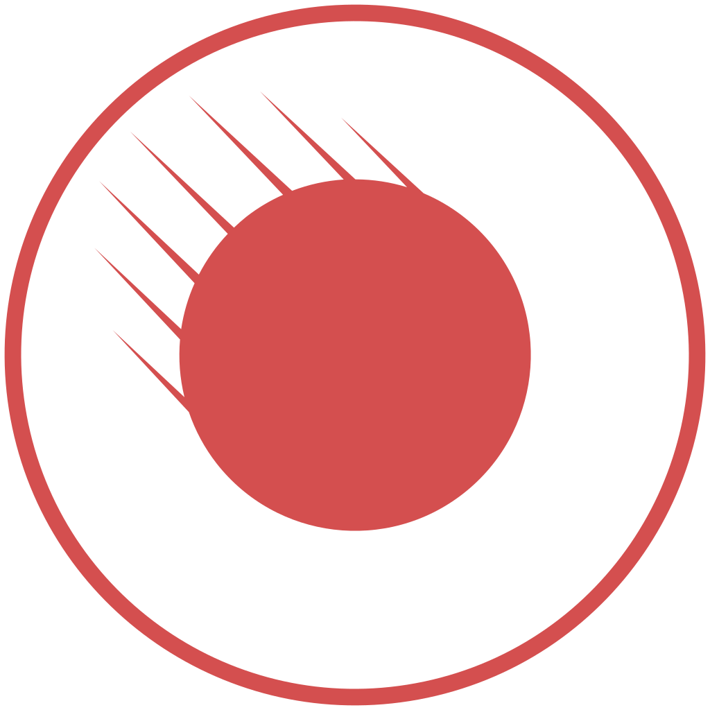

[](https://gitter.im/JoeyAndres/meteor-ionic?utm_source=badge&utm_medium=badge&utm_campaign=pr-badge)

# meteor-ionic

### Build [Ionic](http://ionicframework.com/) apps in [Meteor](https://www.meteor.com/)!

## Overview

This is an attempt at **real Ionic and Meteor integration**. This is not just Ionic's CSS framework wrapped in a Meteor package. It aims to be a complete port of [Ionic’s Angular directives](http://ionicframework.com/docs/api/) to [Meteor Blaze](https://www.meteor.com/blaze) templates.

Note: This is a forked of meteoric:ionic, which is now not maintained. In response, I decided to fork it, and maintain this package for my own. I have written acceptance test on [JoeyAndres/ionic-demo](https://github.com/JoeyAndres/ionic-demo), which is a fork of meteoric/demo.

## Why?
[Ionic](http://ionicframework.com/) is arguably the most comprehensive, polished, cross-platform mobile framework available. But unfortunately a large portion of its functionality comes from Angular directives. [I'm not a fan of trying to force-fit Angular into Meteor](https://medium.com/space-camp/your-meteor-app-probably-doesnt-need-angular-13986a0323f6), so I wanted to see if I could rewrite Ionic specifically for Meteor.

## Install

```bash
meteor add jandres:ionic
```

## Dependencies

- [jandres:meteoric-sass](https://github.com/JoeyAndres/meteoric-sass/) Ionic's scss only package and currently up to date with ionic v1.2.4

## Examples

### Demo of all components
The demo app of various ionic components

[Demo](http://meteoric-demo.com/) |  [Code](https://github.com/JoeyAndres/ionic-demo) branch 1.2.4-dev
